# Лабораторная работа №4. Формы и валидация данных

## Цель работы

Познакомиться с основами создания и управления формами в **Laravel**.

Освоить механизмы валидации данных на сервере, использовать предустановленные и кастомные правила валидации, а также научиться обрабатывать ошибки и обеспечивать безопасность данных.

## Выполнение лабораторной

### Создание формы
1. 
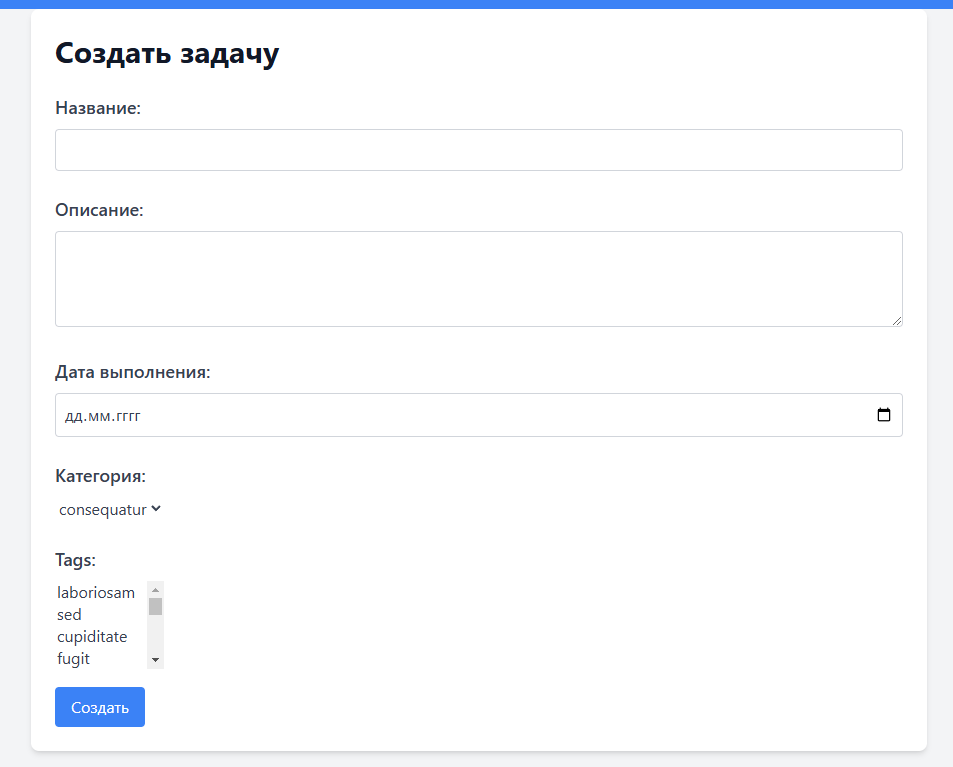

2. 
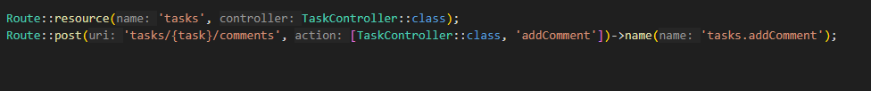

3. 
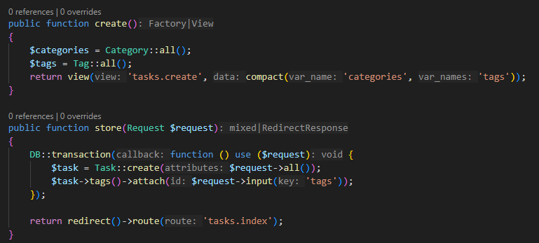

### №3. Валидация данных на стороне сервера

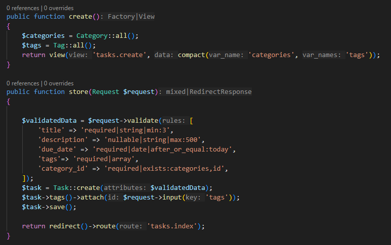

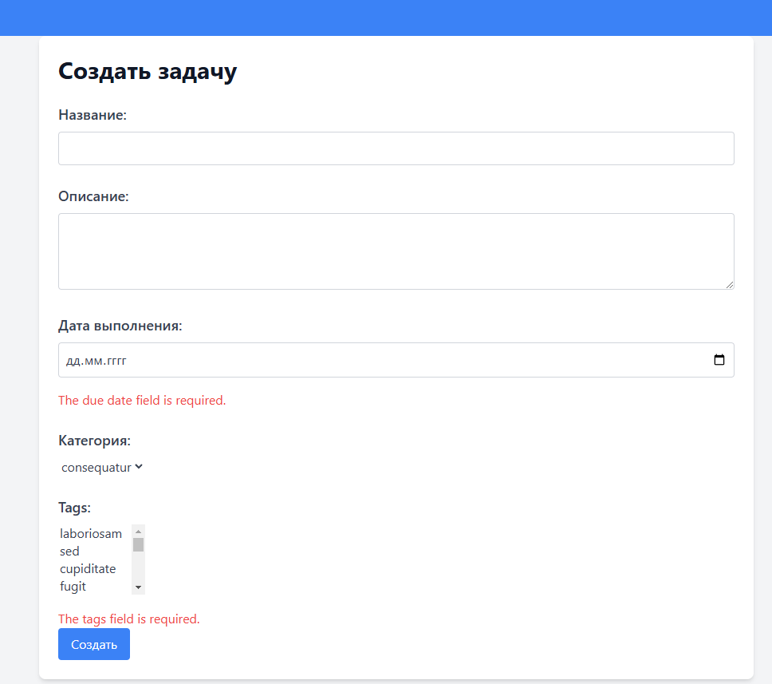

### №4. Создание собственного класса запроса (Request)

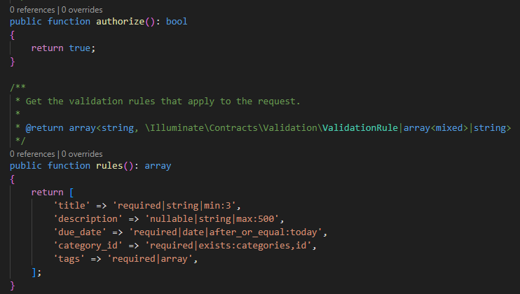

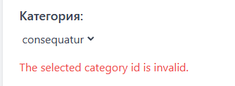

### №5. Добавление флеш-сообщений

```php
session()->flash('success', 'Задача успешно создана.');
```

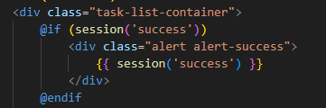

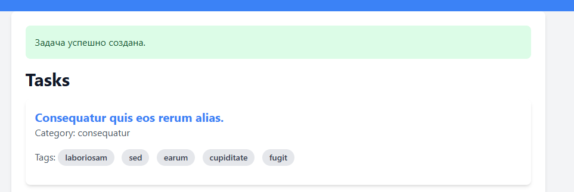

### №6. Защита от CSRF

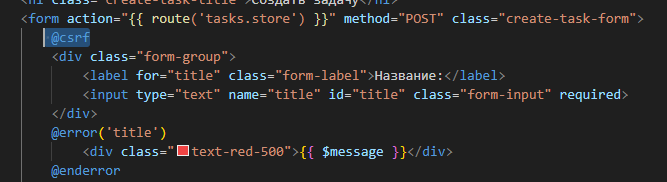

### №7. Обновление задачи

```bash
php artisan make:request UpdateTaskRequest
```

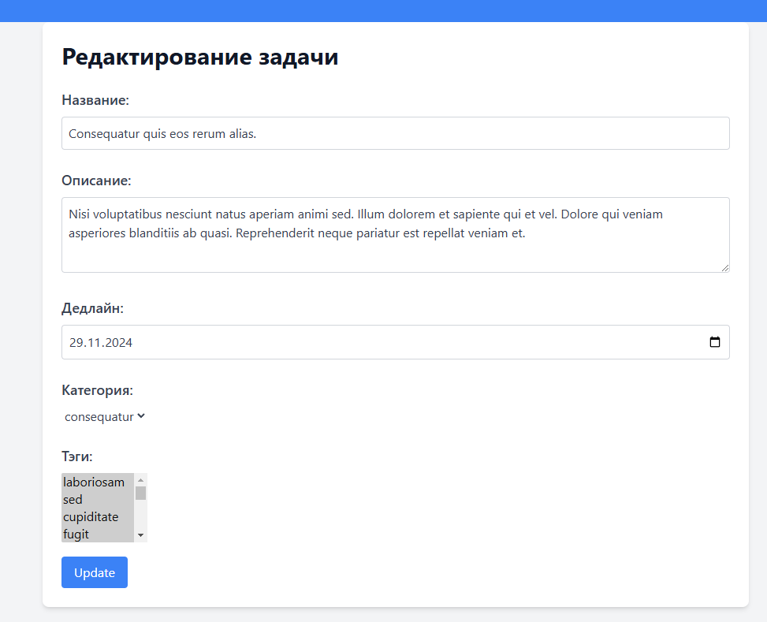

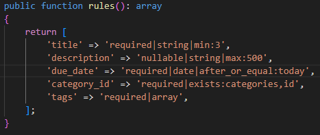

### Дополнительное задание

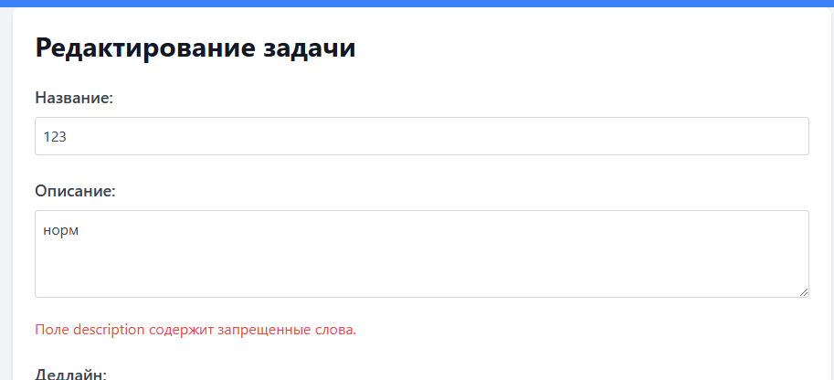

## Контрольные вопросы

1. Что такое валидация данных и зачем она нужна?

    Валидация данных — это процесс проверки данных на соответствие определённым правилам и требованиям перед их обработкой или  сохранением. Валидация помогает обеспечить целостность и         корректность данных, предотвращает ошибки и уязвимости, такие как SQL-инъекции и XSS-атаки, и улучшает пользовательский опыт, предоставляя обратную связь о некорректных данных.

2. Как обеспечить защиту формы от CSRF-атак в Laravel?

    В Laravel защита от CSRF-атак обеспечивается автоматически с помощью встроенного механизма CSRF-токенов. Чтобы защитить форму, необходимо добавить директиву @csrf внутри тега form:
    ```php
    <form action="{{ route('tasks.store') }}" method="POST">
        @csrf
        ...
    </form>
    ```
3. Как создать и использовать собственные классы запросов (Request) в Laravel?

    Для создания собственного класса запроса используится команду Artisan:
    ```bash
    php artisan make:request CreateTaskRequest
    ```
    В котором уже настраиваются правила валидации и авторизации.

4. Как защитить данные от XSS-атак при выводе в представлении?

    Для защиты данных от XSS-атак при выводе в представлении используются функции экранирования, такие как {{ }} в Blade-шаблонах Laravel. Эти функции автоматически экранируют специальные символы HTML, предотвращая выполнение вредоносного кода:
    ```php
    <div>{{ $task->description }}</div>
    ```